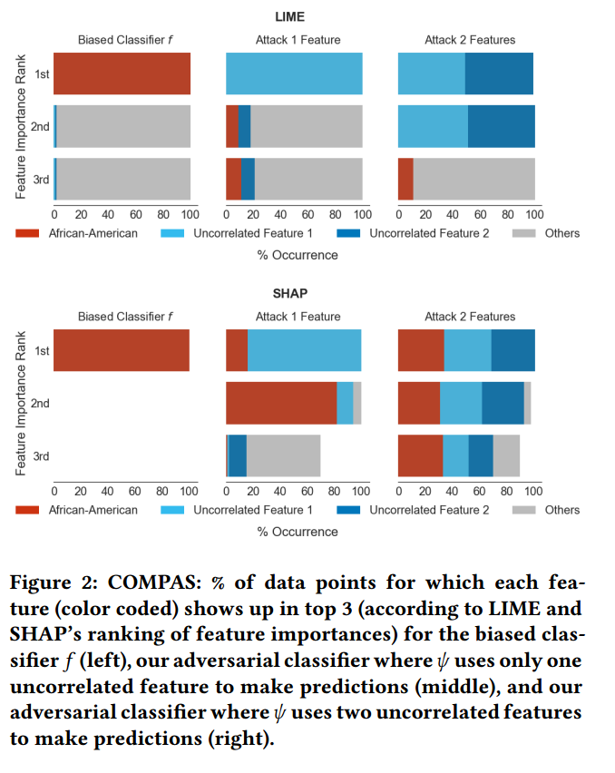
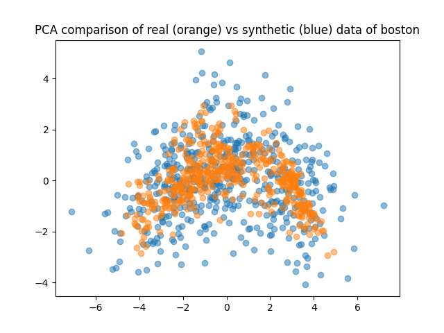

# Fooling LIME and SHAP: Adversarial Attacks on Post hoc Explanation Methods 

## Description
Post-hoc explanation techniques that rely on input pertubations, such as LIME and SHAP, are not
reliable towards systematic errors and underlying biases.
In this project, the scaffolding technique from Slack et al. should be re-implemented, which
effectively should hide the biases of any given classifier.
* Paper Reference: https://arxiv.org/abs/1911.02508
* Code Reference: https://github.com/dylan-slack/Fooling-LIME-SHAP

### Examples
<!-- 

 -->
<p align="middle">
  
   
  
</p>

# Seed
The seed for the experiments can be set in `classifiers/model_configurations/experiment_params.json` file. This seed has been fed into all files.
## Datasets
For this project 5 datasets are used. Three of them (i.e. COMPAS, Communities and Crime and German Credit) are used in the paper.

1.  COMPAS: https://github.com/propublica/compas-analysis/
2.  Communities and Crime: https://archive.ics.uci.edu/ml/datasets/communities+and+crime
3.  German Credit: https://archive.ics.uci.edu/ml/datasets/statlog+(german+credit+data)

To test the observations and claims in this paper, we also added two other datasets with discriminative feature(s).

1.  Boston Housing: https://www.cs.toronto.edu/~delve/data/boston/bostonDetail.html
2.  Students Performance: https://archive.ics.uci.edu/ml/datasets/student+performance

## Extensions
1.  PDP: Additionally to LIME and SHAP, we have incorporated a custom implementation of PDP and analyzed the effects of the fooling method on it.
    * This can be found in `tasks/PDP_adv_compas_test.ipynb` 
2.  Perturbation Analysis: We also used different pertubation approaches and compared their impact on being fooled.
    * This can be found in `sample.py`
3.  Hyperparameter sensitivity analysis: We analyzed the impact of the hyperparamters of LIME and SHAP on the results.
    * If you set `analysis_mode = True` in each of the tasks, it will run `analysis/lime_shap_parameter_selection.py` in analysis mode and it tries the permutations of LIME and SHAP hyperparameters. 
    <p align="middle">
      
       
    </p>
4.  OOD Classifiers: In addition to analyzing different LIME and SHAP hyperparameters, we trained multiple classifiers for detecting out of distribution instances.
    * It can be found in `analysis/ood_classifiers_best.py`, in which we used scikitlearn piplelines to train different classifiers with permutations of their main hyperparameters the analyze the effect.
5. PCA for all 5 datasets to see the difference between perturbed instances and ground truth.
  <p align="middle">
    
     
    
    
    
  </p>
  
# Installation
  ```
  conda create -n limeshap python=3.9
  conda activate limeshap
  pip install -r requirements.txt

  # to run jupyter notebook inside the project
  conda install nb_conda
  ```

# Description of files
## `analysis/ood_classifiers_best.py`
This file will run the grid search for the OOD classifier using scikitlearn pipelines, and tries to find the best classifer with best hyperparameter selction under the ranges given by the user.

Grid search will run on the 9 different classifiers:

1.  LogisticRegression
2.  SVC
3.  KNeighborsClassifier
4.  GaussianNB
5.  MultinomialNB
6.  DecisionTreeClassifier
7.  RandomForestClassifier
8.  GradientBoostingClassifier
9.  MLPClassifier

Parameter range for each classifer can be changed in parameters_classifiers() function in the file. If you want to find the classifer instead of COMPAS you have to import first from tasks for instance run_cc(community crime) and change it in the line 343. And also, you have to see if the unrelated index is 1 or 2.

## `tasks/PDP_adv_compas_test.ipynb`

This jupyter file is designed for the PDP(partial dependent plot) testing. In this file you have to define the categorical feature vector for the given dataset, and also the unrelated features that how many you want to have for your classifier. Thereafter, the results will be saved in graphics/PDP folder.

## `analysis/lime_shap_parameter_selection.py`
This Script calculates the possible permutations over LIME and SHAP parameters and iterates over them to consider the change in the results for each permutation. In each iteration, the model is trained with the current parameter combination then the model is applied to all the instance of test dataset. Then the explanations are summarized for each permutation and their fidelity score is computed. At the end the plots are generated for each explanation summary and the LIME and SHAP results are saved in a csv file.

```
# LIME parameters
# later in the code for the permutations with discretize_continuous == False, the discretizer is set to None.

'kernel_width':[0.15,0.25,0.5,0.75,1.0], 
'discretizer':['quartile', 'decile'],
'discretize_continuous':[True,False],
'feature_selection':['auto'],
'sample_around_instance':[True,False]


# SHAP parameters

'algorithm':["auto", "permutation", "partition", "tree", "kernel", "sampling", "linear", "deep", "gradient"],
'masker':[10,15,20] # this means number of clusters for background distribution
```

## `docs/A Brief Overview of PDP, LIME, and SHAP and Possible Ways to Fool Them for Tabular Data based on The Literature.pdf`
Full documentation on LIME,SHAp and PDP and their fooling methods.


